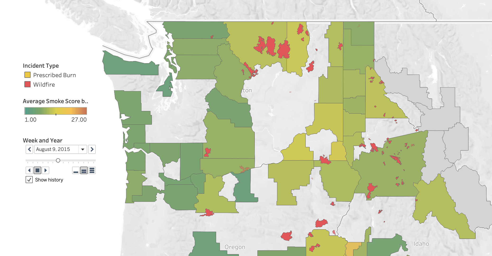
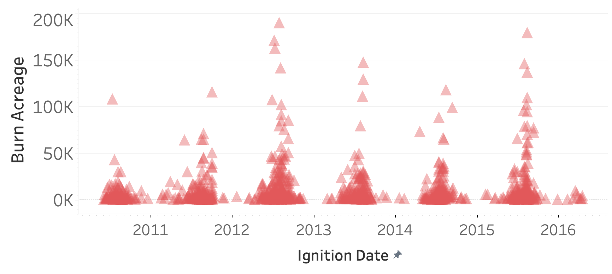
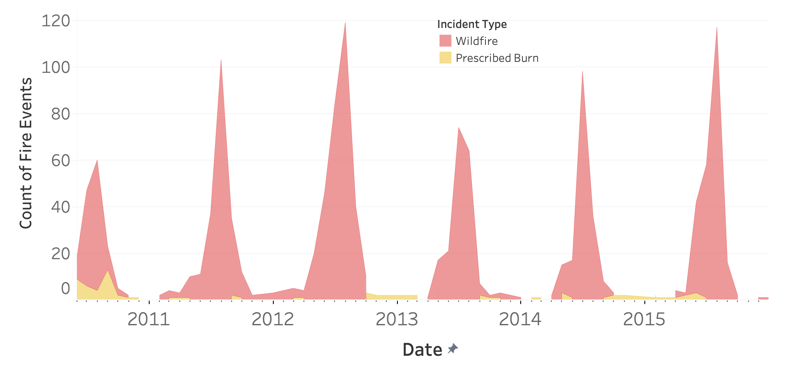
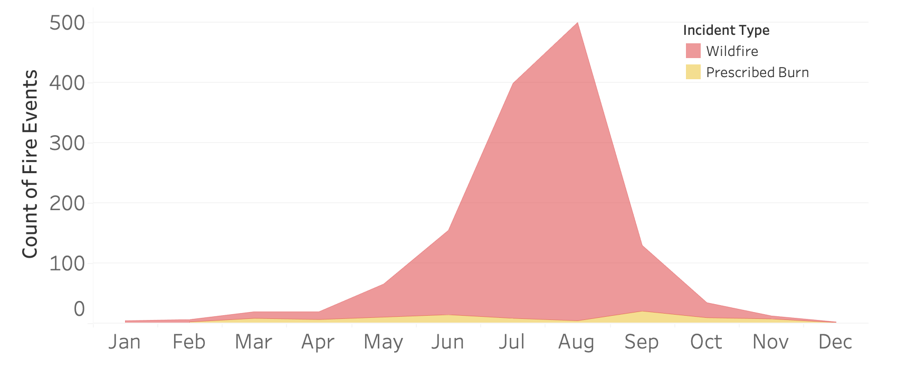
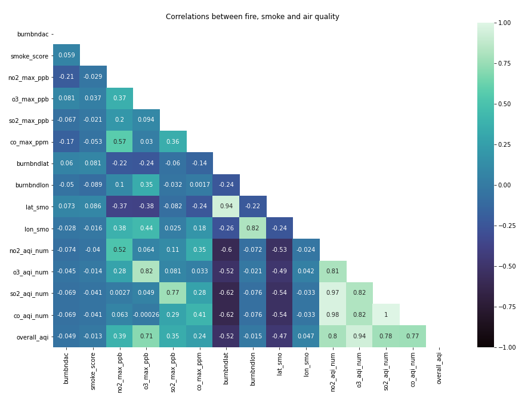

# Wildfires and Air Quality

## Problem space
 

The goal of this project was to determine if the relationship between wildfire events and air quality can be quantified.  Does the type of fire - namely prescribed ("Rx") burns vs wildfire - or the size of fire have an interpretable impact on air quality?  Answering these questions could be used to inform wildfire management.  Fires are a fact: they will occur, and they will cause emissions and air pollution when they do.  If there is a defined relationship between air pollutants, fire acreage, and/or type of fire, management agencies could use this information to determine a burn regimen to optimize air quality and minimize the impact of these events on human health.  I.e., if we could confirm that 1,000 fires under 300 acres have significantly less impact than a single fire of 5,000 acres, that would encourage a high-frequency-low-acreage prescribed burn regimen.

<!------>

<!---[Animation](https://drive.google.com/file/d/1MWZd6geIZfosC4_0ReyLyio-6OQ5f0dS/view?usp=sharing)--->

 

## Team

Veronica Antonova (CA) [LinkedIn](http://linkedin.com/in/vstepanova) | [GitHub](https://github.com/cotica)

Helen Meigs (HI) [LinkedIn](https://www.linkedin.com/in/helenbm/) | [GitHub](https://github.com/welcometohelen)

Riley Robertson (WA) [LinkedIn](https://www.linkedin.com/in/riley-d-robertson/) | [GitHub](https://github.com/rileydr)

  
## Data sources

Many of these data span decades, but our timeframe of focus for this project was primarily 2010-2016.

1. [`Fire data from MTBS`](https://www.mtbs.gov/direct-download), 1984-2020: fire perimeters and ignition points for all U.S. fires from 1984 to present.  Accompanying metrics include acreage burned and various descriptors like type of fire (rx vs prescribed) and incident name.  Later discovered to only record fires >1000 accres in the Western U.S. (>500 in the East).

3. [`Smoke exposure estimates from Harvard Datavese`](https://dataverse.harvard.edu/dataset.xhtml?persistentId=doi:10.7910/DVN/CTWGWE), 2000-2019: preprocessed by Jason Vargo to summarize NOAA Hazard-Mapping System satellite images into geocoded smoke-coverage classes (low, med, high).

4. [`Air pollutant data sourced from the EPA`](https://www.kaggle.com/sogun3/uspollution), 2000-2016:  Concentrations of 4 wildfire-related air pollutants, recording almost-daily from Air Quality Index (AQI) sensors stationed throughout the country. Preprocessed by BrendaSo, made available at kaggle.com

5. Annual fire statistics from [NIFC](https://www.nifc.gov/fire-information/statistics), 2010-2016: yearly totals by State and by fire management agency. No information on individual events, just cumulative acreage and counts per rx and wildfire.

NOTE: Due to the large size of our files, we offloaded our data from the repo to [Google Drive](https://drive.google.com/drive/folders/13RhI8Oj8_XZyFXaePJdo3034PLamHzvn).
  

## Important terminology

* AQI: air quality index; measured from Good (Green) to Hazardous (Purple).

* Prescribed fire: abbreviated 'rx'; a planned fire executed by Tribal, Federal, State, and county agencies to meet management objectives.  Rx fires are used to benefit natural resource management, get rid of excessive fuel loads before they become a bonafide wildfires, and research.

* Wildfire: an uncontrolled burn, originating in wildlands or rural areas (ie not a car burning on a Gotham street corner)

* Smoke score: a classification of light, medium, or heavy corresponding to the density of smoke coverage derived from NOAA's Hazard Mapping Systems satellite imaging (<=5%, 16%, and 27%+, respectively)

- - - 
## Methods

### Data acquisition and wrangling

Fire data were obtained from [MTBS](https://www.mtbs.gov/), "a multiagency program designed to consistently map the burn severity and perimeters of (U.S.) fires" from 1984 to present.  These fire records were combined with panelized time series summation of satellite images denoting smoke coverage down to sub-county level.

### Merging datasets
* The kaggle pollution data was the limiting piece for time range, thus all data were trimmed to 2010-2016.
* We selected States to the west of the Rockies as our region of focus; the idea being that State lines are arbitrary in determining where fire and air are moving, but the Rockies serve as a true barrier for both.  Only States _fully_ west of the range were included, not those that overlapped (CA, AZ, NV, UT, ID, OR, WA).  

All datasets were cleaned to merge on state, county name, and dates (2000-2016).  This involved geocoding counties from the lat/lon coordinates of the fire ignition points.  Latitude and longitude were also reverse geocoded from the addresses of the AQI sensors to use for customized clustering, and because many rural wildfires originated in locations that could not be mapped to a specific county (wildlands).

Despite 'almost-daily' records for smoke and air quality, and despite generalizing their locations to the county level, there were many observations in the merged data where wildfire entries only contained data from one metric or the other.  Dropping either metric (air quality/smoke) would have eliminated about half of the wildfire events in the data, which were already a significant minority.  Initially, as much data were retained as possible, but as modeling attempts progressed, more partial-null observations were dropped.

### Feature Engineering
* AQI: the air pollutants tracked here (SO2, NO2, CO, O3) are all associated with wildfire emissions.  This means that they were all collinear, so no one feature would provide novel information from the others.  Also, the vast majority of these entries were very low scores - each pollutant individually consistently ranked 'good' in the standard Air Quality Index.  To circumvent collinearity conflicts, we created a single score for the pollutants as a group.  We assigned a numeric scale to the daily good->hazardous labels for each pollutant and multiplied those numbers to get 'overall_aqi'.

* Geographic clustering: the county names proved too granular, and States too broad.  Furthermore, fires and air don't give a hoot about State and county lines. To create more useful groupings, we performed KMeans clustering on all of the datapoints (sensors, smoke imagery, fire locs) mapped to their given or reverse geocoded lat/lon.  After trial and error, we settled on 32 clusters to appropriately encompass our datapoints.

* KMeans was chosen for this process because we wanted to classify _all_ of the data and not allow for outliers. Fires starting in very rural areas would likely classify as geographic outliers by DBSCAN method and that would not be helpful.  Furthermore, the density of datapoints was varied greatly across the working space, so the fixed epsilon of DBSCAN was too restrictive.

* Fire presence/absence: fires were only described in the data on their date of ignition.  Since fires and their effect on air quality often persist longer than that, we assigned yes_fire for all fires from ignition date _t_ to _t_+7.  For fires in the largest size class defined by management agencies (>5000 acres), this was extended to _t_+14. The presence of fire was indicated for the entire cluster in which the fire occurred.

---

## Modeling
Despite aspirations to utilize machine learning, time series, and other techniques learned recently, this problem statement boiled down to linear regression.  Once the various pollutants were determined collinear, the whole air quality dimension of analysis was reduced to a single feature (overall_aqi).  As goals were to inform management, inferential and interpretable relationships were critical.  Predicting a wildfire on any given day is not a helpful tool unless one can articulate the reasons behind the prediction, and then act to mitigate. Thus, linear regression.

Modeling overall was crippled by the inexplicable _lack_ of fluctuations in aqi.  While some signals could be seen in nearby sensors during known large fire events, the vast majority of aqi data were constant baseline scores.  Based on interactive Tableau mapping, it was clear that smoke scores, on the other hand, did fluctuate over time and with fires.  This meant that the smoke data and the aqi data were essentially in conflict with each other and there were no definitive correlations in the data.

The dummy model on the aggregated data yielded a 0 training r2 score, and a negative test r2 score.  To see if there were regional patterns that were muted when part of the whole, linreg was performed on all 32 clusters.  These models were attempted to compute overall_aqi (y) based on (X) fire presence, fire acreage, type of fire (rx or wild), and smoke score.  Smoke score and overall_aqi were squared to add more weight to scores that increased from baseline.

Our best model score was for cluster 19 - a region in southern Arizona with the most complete data of the entire survey area (the most overlapping smoke, aqi, and fire events).  The few counties in cluster 19 practiced frequent prescribed burns relative to other areas so we were still optimistic that we could pull out some relation between all of the features.  The best testing r2 was 2.4%.

These results were disappointing, especially given the intuitive and seemingly significant story told by data visualization (see: Riley Robertson's Tableau notebook + EDA section of this report).

- - - 
  
## Data exploration

We have sought to understand some the following:

* Is there a direct relationship between AQI and fires?

* Does the type of fire (rx vs. wildfire) and/or area of burn have predictable impacts on air quality in surrounding areas?
    * if so, how long does it take for air quality to return to baseline, or at healthy 'levels of concern', as defined by the EPA?

* What fire trends can be observed over the years?

* Is there a cyclical relationship we can identify between smoke, fire and air quality? And if so, can we identify and interpret any seasonal patterns?

<!---_Insert Helen's state by state charts from slide deck_--->
 

<!---<iframe width="560" height="315" src="https://www.youtube.com/embed/videoseries?list=PLx0sYbCqOb8TBPRdmBHs5Iftvv9TPboYG" frameborder="0" allow="autoplay; encrypted-media" allowfullscreen></iframe>--->

  
## Key findings

* 94% of all fires are wildfires (rest are prescribed)
* California dominates both wildfire frequency and the pollution charts
* The vast majority (70%) of fires have a smoke score of 'light'

* There seems to be no relationship between the smoke score and the acreage of fire's impact (burn)

* The most massive fires, by burn acreage, in our dataset are in 2012 and 2015

* There is a strong seasonal pattern from the hottest summer to fall months:

 

* Some relationships can be detected among the following, which tell us that smoke and fire really do align geographically:
   * `no2_max_ppb` and `co_max_ppm`
   * `burnbndlat` and `lat_smo` (burn and smoke latitude)
   * `burnbndlon` and `lon_smo` (burn and smoke longitude)

* We can further see relationships between the individual components of the AQI, indicating that pollutants move together:

  
## Recommendations and conclusions

Many factors influence air quality (_[source](https://docs.google.com/document/d/11ob6Qt6jiWdM_G-ge4UOWN0kTx-5hHZep2QBnOp1yjY/edit?usp=sharing)_). Any many unexplored features determine the intensity and impact of wildfires, such as local and global climate patterns, and vegetation type and density.  This analysis sought to determine if wildfire type and size alone can be used to estimate air quality in nearby regions.  Fire will always happen, and this process will always release greenhouse gases and other pollutants that degrade air quality.  If the relationship between fire type, size, and air pollution is predictable, this could be extrapolated to inform an optimal controlled burn regimen that minimizes detrimental impacts on air quality and human health.  

  
## Python notebooks and presentation Links

* [`Cleaning` notebook](https://github.com/rileydr/AirQuality-USWest/blob/main/code/hm_notebooks/1_cleaning_smoke.ipynb)
* [`Merging` notebook](https://github.com/rileydr/AirQuality-USWest/blob/main/code/hm_notebooks/2_merging_smoke_fires.ipynb)
* [`EDA`](./code/va-EDA.ipynb)
<!---* [`Scraping` notebook]()--->
* [`Modeling` notebook](https://github.com/rileydr/AirQuality-USWest/blob/main/code/hm_notebooks/5_modeling_feature_eng.ipynb)

* [`Slides`](https://docs.google.com/presentation/d/10I3ZuSoi1APt5GTSe4lJPC51fLsKmMWfKAVmRrd-5NY/edit#slide=id.p)
* [`Tableau interactive demo`](https://public.tableau.com/profile/riley.robertson#!/vizhome/wildfires_v2/FIRESANDSMOKEOverTime)
<!---

--->
  
